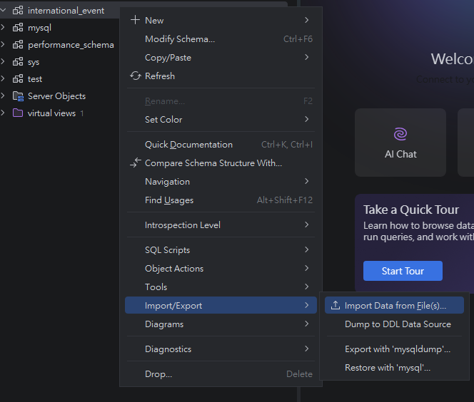
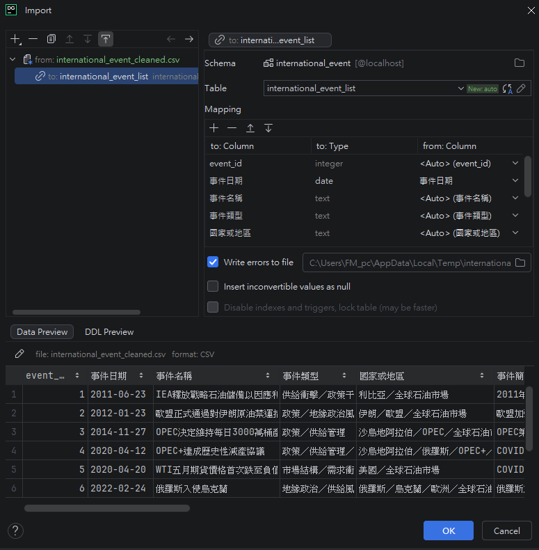
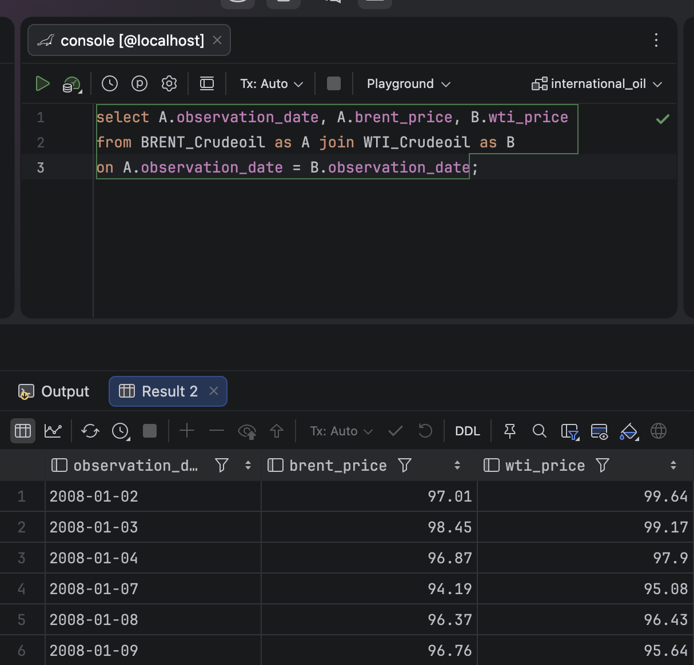
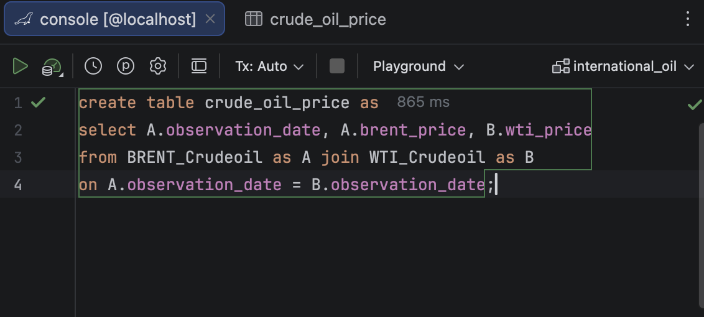
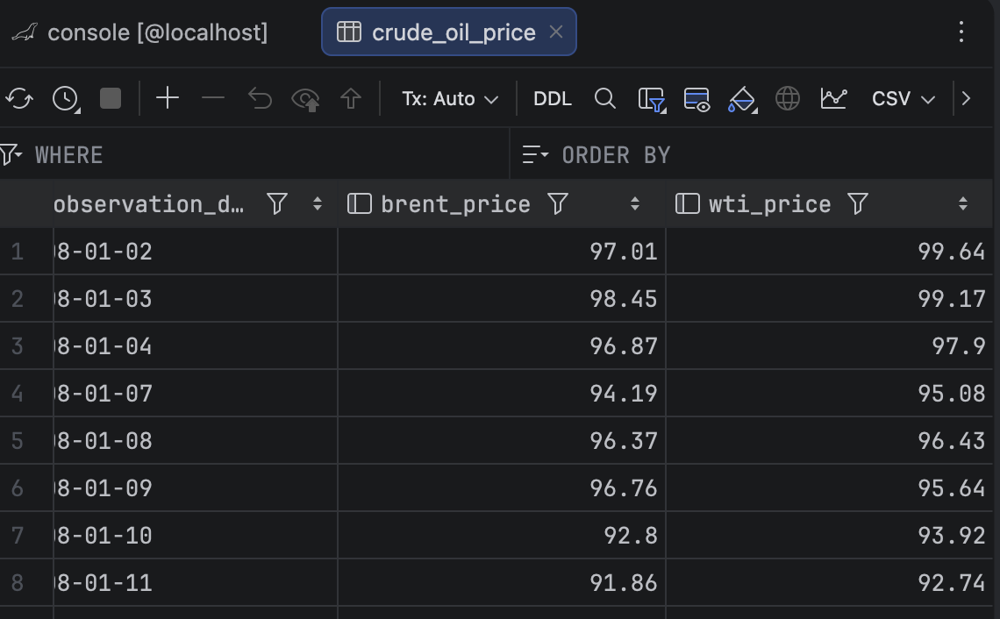
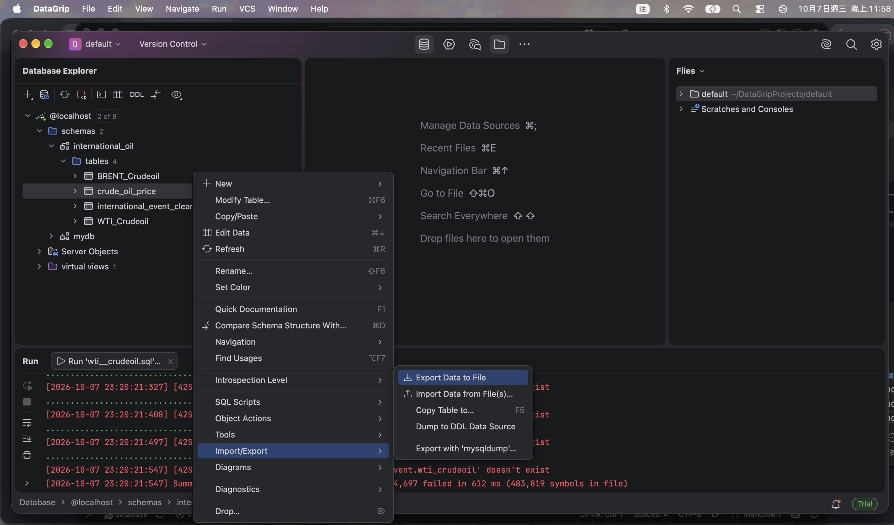
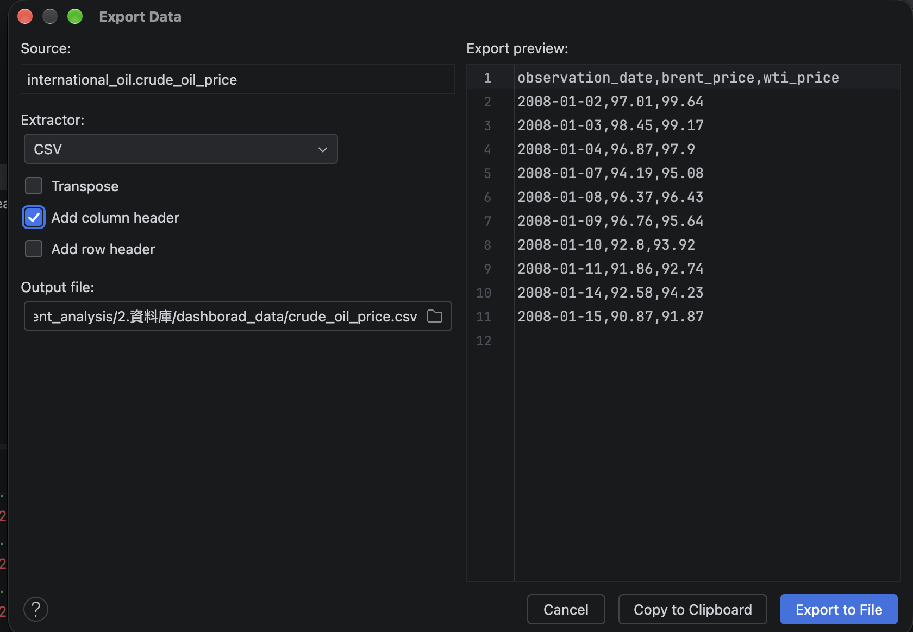

# 資料庫
資料庫部分使用的工具為:
- 資料庫:MariaDB
- 資料庫GUI管理工具:DataGrip

資料匯入皆以DataGrip來完成
## 1.建立資料庫
建立 Database/Schema (MySQL的Database=Schema)

## 2.匯入資料
在建立好的Database/Schema 匯入清理好的Brent及WTI原油價格csv檔

DataGrip會自動建Table並自動偵測及創建Columns
但資料類型需再調整一次

資料匯入完成

## 3.合併資料
先寫join語法測試結果

建立一個新的Table把現有的Brent及WTI原油價格表進行合併

建立完成

## 4.匯出合併後的資料
把合併好的原油價格表匯出成CSV

